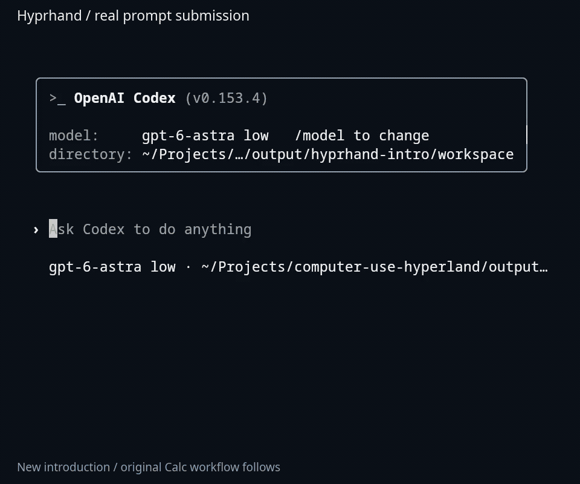
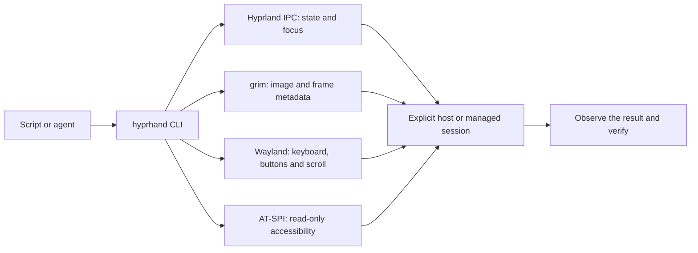
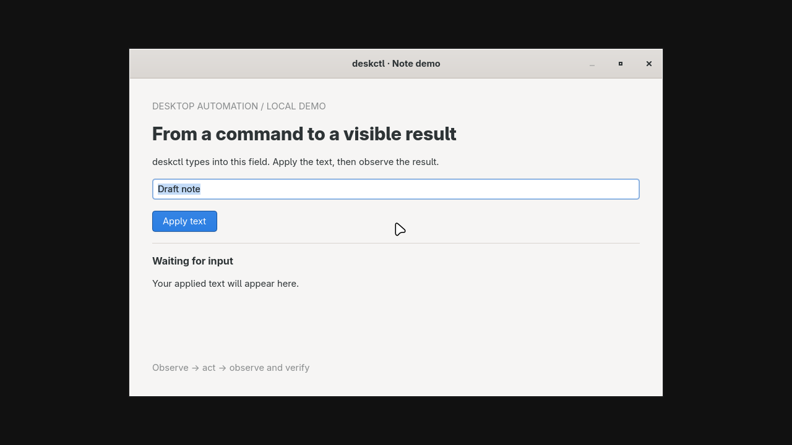
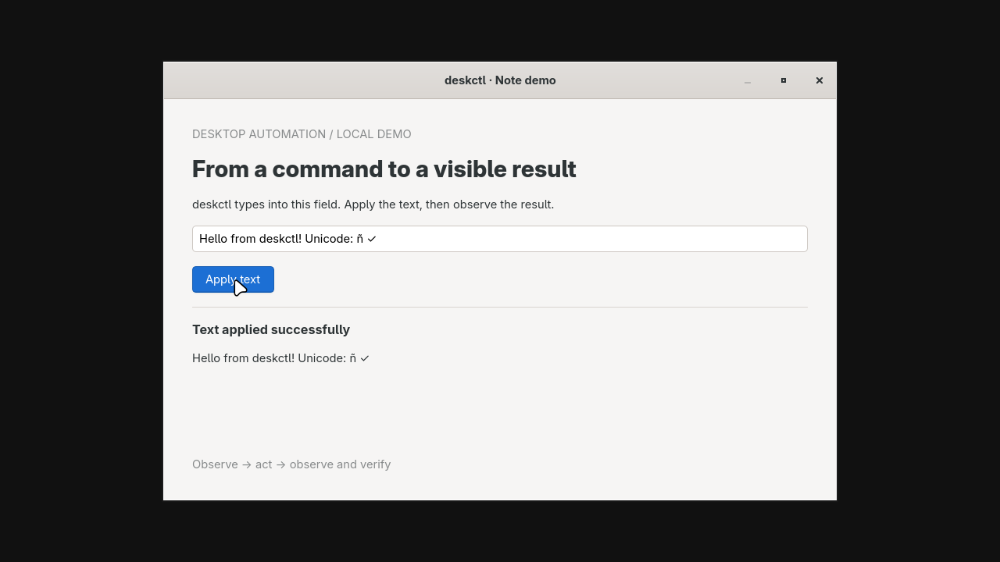
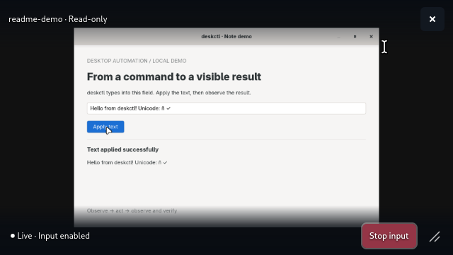
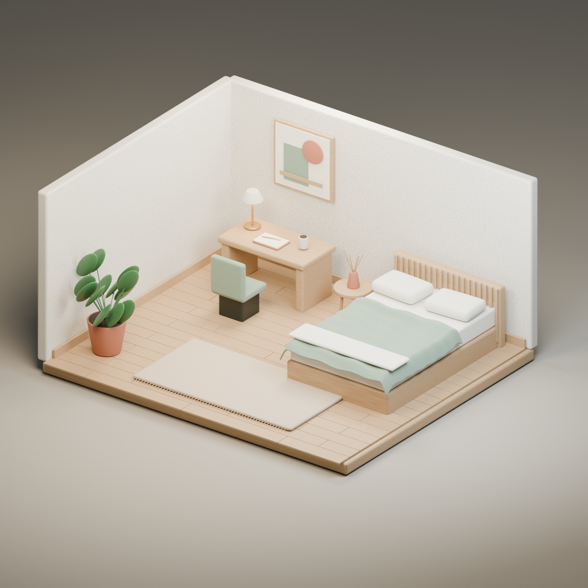

# Hyprhand

**Local desktop automation for Linux and Hyprland, written in Zig.**

Hyprhand gives scripts and external AI agents a command-line interface to inspect
windows, capture screenshots, and send mouse and keyboard input. Commands return
structured JSON. The tool runs locally: it includes no AI model, MCP server,
clipboard transport, or always-on input service.

Use your current desktop when you want to share its cursor, or launch applications
inside a managed Hyprland session with independent input. The optional GTK4
Picture-in-Picture viewer lets you watch a managed session from your desktop.

**Current source version: 0.4.0.** This is an early project with a deliberately
limited [compatibility matrix](docs/compatibility.md). Managed sessions isolate
input; they share your user account's files, credentials, network, and permissions.

Previously named **deskctl**. The CLI is now `hyprhand`; see the
[rename and upgrade notes](docs/renaming.md) for installation and session changes.

## Watch an agent build a spreadsheet



The preview animates directly in this README. It shows the **actual prompt being
submitted in Codex**, then a real LibreOffice Calc spreadsheet taking shape:
data, achievement formulas, styled headers, totals, and a native column chart.
The prompt plays at normal speed; the condensed desktop preview runs at 6× with
waiting intervals cut. The final result is held for inspection. The introduction
was re-recorded with **Hyprhand** and joined to the original Calc workflow;
[editing details](examples/spreadsheet/README.md#refreshed-hyprhand-introduction) describe the two takes.

[Task prompt](examples/spreadsheet/prompt.txt) ·
[Saved spreadsheet](examples/spreadsheet/launch-dashboard.ods) ·
[Input data](examples/spreadsheet/data.csv) ·
[Command transcript](examples/spreadsheet/commands.json)

The agent entered fictional data, calculated **1,980 signups / 1,700 target =
116.47% achievement**, created the chart, saved the document, and stopped input.
This demo uses Calc and needs no Google account. It uses real mouse and keyboard
input; no spreadsheet API or generated workbook replaces the recorded actions.
See the [recording guide](examples/spreadsheet/README.md) for the setup,
verification, full recording, and edit timeline.

[Try the simpler note demo](#example-fill-and-apply-a-note) ·
[Watch the earlier note recording](examples/video/README.md) ·
[See the live viewer](#watch-and-stop-the-agent) ·
[Explore the Blender example](#example-style-a-blender-room)

## What it can do

| Area | Features |
| --- | --- |
| Observe | Monitors, windows, workspaces, active window, cursor, PNG screenshots with coordinate metadata |
| Act | Focus, workspace changes, smooth movement, click, double click, drag, scroll, Unicode text, shortcuts |
| Verify | Expiring frames, focus/layout validation during actions, cursor interference detection, dry runs |
| Synchronize | Wait for windows, focus, workspace, geometry or pixel stability; NDJSON compositor events |
| Isolate input | Create, inspect, list, launch into, and destroy managed nested or headless sessions |
| Monitor | Optional read-only GTK4 preview with source cursor and an input-stop control |
| Accessibility | Bounded, read-only AT-SPI tree; password values and children are omitted |
| Integrate | JSON errors, Bash/Fish completions, an agent skill, offline tests, checksummed local packages |

A second workspace in the same compositor does **not** isolate keyboard or mouse
input. Targeted shortcuts can briefly steal foreground keyboard focus even when
Hyprland reports an unchanged active window. See the [background-input probe](docs/background-probe.md).
A separate session runs its own applications; it does not provide a second cursor
for your existing host windows.

## How it works



The core workflow is **observe → act → observe and verify**. A screenshot includes
a frame ID and the mapping from image pixels to logical desktop coordinates.
Pointer commands validate that frame, the selected session, control permission,
focus, and relevant layout before and during input. If those assumptions change,
the action aborts. `status: sent` confirms that input was sent; it does not prove
that an application saved a file, clicked the intended control, or completed a task.

The [architecture guide](docs/architecture.md) explains module boundaries,
timeouts, resource ownership, and preview transport. The [CLI reference](docs/cli.md)
documents commands, options, JSON, coordinates, and cancellation.

## Requirements

- Linux with pidfd support (kernel 5.3+) and a working Hyprland session.
- **Zig 0.16.x** to build; CI and packaging pin **0.16.0** in `.zigversion`.
- `pkg-config`, `wayland-scanner`, libc development files, and headers/libraries
  for Wayland client, xkbcommon, AT-SPI, and GLib/GObject.
- `grim` for screenshots. `xdotool` for XWayland keyboard/scroll;
  `wtype` only for an explicitly selected Wayland helper keyboard backend.
- Managed sessions additionally use `Hyprland`, `dbus-daemon`, and
  `at-spi2-registryd` when accessibility is needed.
- Python 3.11+ for the full offline test and packaging suites.

GTK4 >= 4.8 is needed only for the optional viewer. See
[dependencies and installation](docs/dependencies.md) for build packages,
feature-specific requirements, and binary compatibility limits.

## Build and install

```sh
git clone https://github.com/Osmait/hyprhand.git
cd hyprhand
zig version                       # Expected: 0.16.0 for the pinned workflow
zig build -Doptimize=ReleaseSafe
./zig-out/bin/hyprhand --help
./zig-out/bin/hyprhand doctor --session host

# Install for the current user:
zig build -Doptimize=ReleaseSafe --prefix "$HOME/.local"
export PATH="$HOME/.local/bin:$PATH"
```

Run `doctor` from a terminal inside the target Hyprland desktop. It reports
prerequisites and protocol availability without injecting input. An available
prerequisite is not a verified screenshot, successful headless startup, or working
accessibility tree; inspect its `checks` fields.

Installation adds `bin/hyprhand`, Bash/Fish completions, and
`share/hyprhand/skills/hyprhand`. It does not edit your Hyprland configuration.
Shells may need their normal completion setup for a user-local prefix.

To install the optional viewer alongside the CLI:

```sh
zig build pip -Doptimize=ReleaseSafe --prefix "$HOME/.local"
```

The [packaging guide](packaging/README.md) explains how to build and verify Linux
x86_64 archives. They depend on compatible system libraries and are not universal
static binaries. Packaging does not publish a GitHub Release.

## Example: fill and apply a note

The included GTK application makes the input/output loop easy to see. It requires
Python GI and GTK4 in addition to hyprhand. Run these commands from the checkout:

```sh
hyprhand session create note-demo --nested
hyprhand enable --session note-demo
hyprhand launch --session note-demo -- python3 "$PWD/examples/gtk/note.py"
hyprhand wait window --session note-demo --class org.hyprhand.NoteDemo
hyprhand windows --session note-demo
```

Copy the matching window's `address` from `data`, then replace `WINDOW_ADDRESS`
below. The application starts with the note field focused.

```sh
hyprhand focus WINDOW_ADDRESS --session note-demo
hyprhand wait focus --session note-demo --window WINDOW_ADDRESS
hyprhand observe --session note-demo
```

**Before:** open `frame.image_path` and inspect the starting state.



Replace the text, let the application paint, and inspect a fresh screenshot:

```sh
hyprhand key ctrl+a --session note-demo --window WINDOW_ADDRESS
hyprhand type --session note-demo --window WINDOW_ADDRESS \
  --text 'Hello from hyprhand! Unicode: ñ ✓'
hyprhand wait stable --session note-demo --pixels
hyprhand observe --session note-demo
```

Use the new `frame.frame_id` and the **Apply text** button's coordinates **from
your actual PNG**, replacing `FRAME_ID`, `BUTTON_X`, and `BUTTON_Y`:

```sh
hyprhand click --session note-demo --window WINDOW_ADDRESS \
  --frame FRAME_ID --x BUTTON_X --y BUTTON_Y
hyprhand wait stable --session note-demo --pixels
hyprhand observe --session note-demo
```

**Verify:** the final image should show **Text applied successfully** followed by
`Hello from hyprhand! Unicode: ñ ✓`. The original screenshot below uses the
previous name, deskctl. Applying text only changes
this demo window; it does not save a file or send a network request.



```sh
hyprhand stop --session note-demo
hyprhand session destroy note-demo
```

The screenshots used a dedicated headless test session with the explicit
experimental bridge; `--nested` is shown here for the simpler setup. Your theme,
window geometry, and coordinates can differ. See the
[full walkthrough](examples/gtk/README.md) for dry runs, preview, and capture details,
and [image provenance](docs/images/README.md) for the recorded environment.

## Quick start: current desktop

Start by inspecting the session:

```sh
hyprhand doctor --session host
hyprhand windows --session host
hyprhand monitors --session host
```

Choose a real window address from `windows` and a monitor name from `monitors`.
In the examples below, replace `WINDOW_ADDRESS`, `MONITOR_NAME`, and `FRAME_ID`
with values returned by your session. Coordinates are illustrative: select the
actual target from your screenshot.

```sh
hyprhand enable --session host
hyprhand focus WINDOW_ADDRESS --session host
hyprhand wait focus --window WINDOW_ADDRESS --session host
hyprhand observe --session host --monitor MONITOR_NAME

# Open frame.image_path, then use that frame's ID and image coordinates:
hyprhand click --session host --frame FRAME_ID --x 620 --y 340 --dry-run
hyprhand click --session host --frame FRAME_ID --x 620 --y 340
hyprhand observe --session host

# Only send text/shortcuts to the exact focused window:
hyprhand type --session host --window WINDOW_ADDRESS --text 'Hello, Unicode: ñ ✓'
hyprhand observe --session host
hyprhand stop --session host
```

Focus the destination **before** observing. Frames expire after 30 seconds and
become invalid when relevant focus or geometry changes. Obtain and inspect a fresh
frame after each action. Dry runs validate actions without injecting input and
can run while control is stopped. On `host`, your mouse and keyboard remain shared.

## Quick start: independent session

```sh
hyprhand session create agent --nested
hyprhand session inspect agent
hyprhand enable --session agent
hyprhand launch --session agent -- firefox about:blank
hyprhand windows --session agent
hyprhand observe --session agent

# Requires the optional viewer installed beside hyprhand:
hyprhand preview --session agent --fps 5
```

`--nested` opens a compositor window; opening or closing it can affect host focus.
Input inside the child compositor is independent. Omitting `--nested` requests
headless operation, which still needs the parent Wayland compositor's renderer.
Some GPU stacks cannot allocate suitable headless buffers. Failures never silently
switch control to `host`. An optional, version-specific bridge is described in
[experimental bridges](docs/experimental-bridges.md).

Managed applications must use Wayland; managed sessions disable XWayland and
remove the host `DISPLAY`. Browser profiles and XDG directories are session-local.
Generic application process reuse still needs verification. See the
[session guide](docs/sessions.md) for routing, environment, lifecycle, and cleanup.

When finished:

```sh
hyprhand stop --session agent
hyprhand session destroy agent
```

`stop` disables hyprhand input without closing applications. `session destroy`
closes tracked session processes and applications, retaining profiles and logs
for diagnosis. It does not delete user documents.

## Watch and stop the agent



```sh
# Use an existing managed session; keep this command running in its own terminal.
hyprhand preview --session note-demo --fps 5
```

The [Picture-in-Picture viewer](docs/preview.md) shows the managed desktop and its
cursor in a floating, pinned, borderless window. Drag the image to move the viewer
and its lower-right grip to resize it. The source image is limited to 960 × 540,
at up to 1–15 fps (5 by default), backing off to 1 fps when unchanged.

- **Stop input** revokes hyprhand input permission in the source session. It leaves
  applications and external agent processes running.
- Controls and status appear on hover or Tab navigation; at rest, only the
  session image is shown.
- **Close** closes only the viewer. It does not stop input or terminate the agent.
- **No signal** clears stale or unavailable imagery. The viewer never forwards
  clicks or keys into the source and never enables control.

## Example: style a Blender room



The repository includes an editable original room, a styled scene, and the Python
styling pass that adds procedural materials, furniture details, lighting, and a
camera. Open `examples/blender/assets/room-original.blend`, then follow the
[Blender walkthrough](examples/blender/README.md) to run the styling pass into your
own output directory. It saves `room-styled.blend`; rendering is a separate step.

To open the example in an independent desktop from the checkout:

```sh
hyprhand session create blender-demo --nested
hyprhand enable --session blender-demo
hyprhand launch --session blender-demo -- blender \
  "$PWD/examples/blender/assets/room-original.blend"
hyprhand windows --session blender-demo
hyprhand observe --session blender-demo
```

Inspect the image before interacting with Blender. When finished, save any work
you want to keep, stop input, and destroy only the demo session:

```sh
hyprhand stop --session blender-demo
hyprhand session destroy blender-demo
```

This image is the existing rendered result of the project example. It is not
proof that every Blender operation works through GUI automation; the verified
shortcut scope and remaining limits are in [compatibility](docs/compatibility.md).

## Agent integration

The repository includes an English [hyprhand skill](skills/hyprhand/SKILL.md) with
session-selection rules and an observe/act/verify workflow. Copy or symlink its
folder into your agent's skill directory. For a user-local Codex installation,
if the destination does not already exist:

```sh
mkdir -p "$HOME/.codex/skills"
ln -s "$HOME/.local/share/hyprhand/skills/hyprhand" "$HOME/.codex/skills/hyprhand"
```

The external agent supplies reasoning and an image-viewing tool. hyprhand needs no
AI credentials. Agents should preserve explicit session selection, verify outcomes,
and never automatically re-enable after a human stop.

## Tests and contributions

```sh
zig build check -Doptimize=ReleaseSafe
zig build test
python3 tests/keyboard_unit.py

# Optional GTK checks on private Broadway sockets:
zig build pip pip-test -Doptimize=ReleaseSafe
python3 tests/viewer_broadway.py
```

The default `check` target performs formatting, Zig unit tests, and all offline
regression suites without desktop input. Live tests are separate opt-in commands
that create windows and send real input; see [testing](docs/testing.md).

Read [CONTRIBUTING.md](CONTRIBUTING.md) for development and pull requests,
[SECURITY.md](SECURITY.md) for the trust model and vulnerability reporting, and the
[documentation index](docs/README.md) for all guides and historical test reports.
The [delivery ledger](PLAN.md) records implemented work and remaining limitations.

## Limitations

- Hyprland is required. Other compositors, GPUs, distributions, and architectures
  need independent validation; see the [compatibility matrix](docs/compatibility.md).
- Isolation is limited to input/session routing. Applications run with your user
  permissions. Accessibility names and screenshots can contain private content.
- Native input cleanup handles ordinary cancellation and catchable signals.
  SIGKILL, compositor failures, and external X11 helpers have weaker guarantees.
- AT-SPI bounds are marked `atspi-screen-unverified`; do not use them as screenshot
  coordinates. Custom application interfaces may expose little or no accessibility.
- Blender support is partial. Verified shortcuts do not establish that all scroll,
  drag, modeling, or editing workflows work. The [Blender example](examples/blender/README.md)
  is a scene-styling demonstration, not an end-to-end automation certification.

## License and third-party notices

A project license has not yet been selected. Public visibility alone does not
grant redistribution rights. The repository owner must select a license before
an open-source release. Vendored Wayland protocols retain their original notices;
see [THIRD_PARTY_NOTICES.md](THIRD_PARTY_NOTICES.md).
